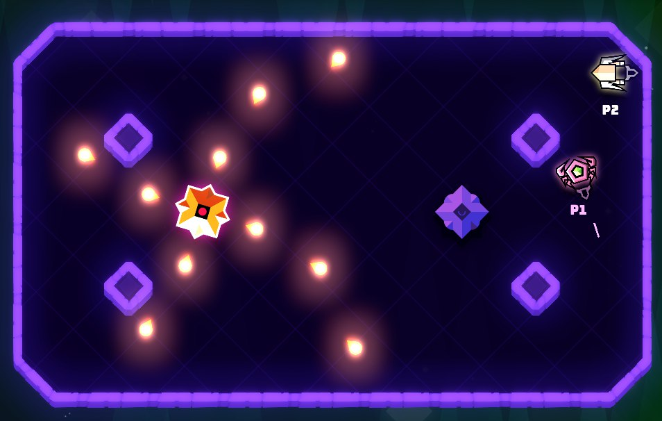

# Starship Olympics

<!--  -->

Welcome to Starship Olympics, a fast-paced multiplayer game where you can compete with other players to become the ultimate starship champion.

In this game, you will pilot your own starship and face off against other players in a variety of challenges and competitions. Whether you prefer to race through a dangerous asteroid field or engage in a thrilling dogfight, Starship Olympics has something for everyone.

Features:
- Multiplayer action with up to 4 players
- Exciting challenges and competitions
- Customizable starships with different weapons and abilities
- Stunning graphics and immersive sound effects
- Free and open source

## Installation and Usage

To get started with Starship Olympics, simply clone the repository and run the game in the Godot Engine. You can also download pre-built binaries for Windows and Linux from the [releases](https://github.com/notapixelstudio/starship-olympics/releases) page.

## Contributing

We welcome contributions from the community to help improve and expand Starship Olympics. Whether you want to submit bug reports, feature requests, or code changes, we appreciate your help.

Please read our [contributing guidelines](CONTRIBUTING.md) for more information on how to contribute.

## Resources used and acknowledgements

All the resources hereby cited are free and royalty-free. Made by the community or contributors.
(Since this game is in Development the following list might change often)

### Game Assets and Third party

All the game assets (art, audio, texture, .svg files) under the folder assets, if not explicitly stated otherwise are under [CC BY NC SA](https://creativecommons.org/licenses/by-nc-sa/2.0/), made by notapixelstudio, the community or contributors. Some of them are from third-party, credited below or explicitly stated under the respective folder

#### Soundtrack

- [Giovanni Nava - Haunting Aliens](https://www.giovanni-nava.com/) 
- [Mattek - Paradoxal Activity](https://soundcloud.com/themattek/mattek-paradoxal-activity)
- Sounds and music from [freesound](https://freesound.org/people/salvob41/downloaded_sounds)

#### Sounds

- [Aidave from freesound](https://freesound.org/people/aidave/downloaded_sounds)
- [List of free sounds](https://v-play.net/game-resources/16-sites-featuring-free-game-sounds)
- [Uso_sketch](https://freesound.org/people/uso_sketch/sounds/443865)
- [GameAudio](https://freesound.org/people/GameAudio/packs/13940/)
- [Jalastram](https://freesound.org/people/jalastram/packs/17801)
- [LewislancasterMusic](https://soundcloud.com/lewislancastermusic) : 0555, 0013shed

You will play as one pilot from a diverse rooster of aliens, and fight to become the <i>champion of the intergalactic Games</i>, a sport competition symbol of unity and peace for all the species of the universe.

## Follow the development

This game is being developed on **`Godot v3.5.1`** 

Join our discord or follow us on Twitter ([@notapixelstudio](https://twitter.com/notapixelstudio)) or on [Instagram](https://instagram.com/notapixelstudio) 

  

Download the game from [itch.io](https://notapixel.itch.io/superstarfighter), or help us shaping it by joining our [Discord](https://discord.gg/tchr6qpj59).

## Resources used and acknowledgements

All the resources hereby cited are free and royalty-free. Made by the community or contributors.
(Since this game is in Development the following list might change often)

### Game Assets and Third party

All the game assets (art, audio, texture, .svg files) under the folder assets, if not explicitly stated otherwise are under [CC BY NC SA](https://creativecommons.org/licenses/by-nc-sa/2.0/), made by notapixelstudio, the community or contributors. Some of them are from third-party, credited below or explicitly stated under the respective folder

#### Soundtrack

- [Giovanni Nava - Haunting Aliens](https://www.giovanni-nava.com/) 
- [Mattek - Paradoxal Activity](https://soundcloud.com/themattek/mattek-paradoxal-activity)
- Sounds and music from [freesound](https://freesound.org/people/salvob41/downloaded_sounds)

#### Sounds

- [Aidave from freesound](https://freesound.org/people/aidave/downloaded_sounds)
- [List of free sounds](https://v-play.net/game-resources/16-sites-featuring-free-game-sounds)
- [Uso_sketch](https://freesound.org/people/uso_sketch/sounds/443865)
- [GameAudio](https://freesound.org/people/GameAudio/packs/13940/)
- [Jalastram](https://freesound.org/people/jalastram/packs/17801)
- [LewislancasterMusic](https://soundcloud.com/lewislancastermusic) : 0555, 0013shed

## Localisation

We would love to have your help in translating this project into different languages. Please follow the instructions below to contribute to the translation effort.

### Requirements

To get started, you will need to have Poedit installed on your system. You can download Poedit [here](https://poedit.net/download).

### How to Contribute

1. Fork the repository and create a new branch for your translation work.
2. Open the messages.pot file located in the locales directory using Poedit.
3. Create a new .po file for your target language by selecting File -> New... and selecting your language.
4. Translate the strings in the file by entering the translated text in the right-hand column.
5. Once you have completed the translation, save the .po file and close Poedit.
6. Commit and push your changes to your forked repository and create a new Merge Request.
7. We will review your changes and merge them into the main repository if they are accepted.

### Guidelines for Translation

Here are some guidelines to keep in mind while translating:

Use simple and clear language.
Keep the translated strings brief and to the point.
Avoid using colloquialisms or cultural references that may not make sense in other languages or regions.
Maintain consistency with terminology and phrasing throughout the translation.
Thank you for your contribution to the translation effort! If you have any questions or concerns, please do not hesitate to contact us through Github or email.

## License

All the code used in this project is opensource and under the MIT License so you can use any part of it on your games developped in GodotEngine (that is also under the [MIT License](https://godotengine.org/license)). The software and official releases/binaries are distributed under our [End-User License Agreement (EULA)](LICENSE_software.txt).

It can be basically summarized into two different licenses:

1. Source code (everything except game assets, under the folder _assets_ ) is distributed under [MIT License](LICENSE_source_code.txt). 
2. All the game assets (art, audio, texture, .svg files) under the folder [_assets_](LICENSE_assets.txt), if not explicitly stated otherwise are under [CC BY NC SA](https://creativecommons.org/licenses/by-nc-sa/2.0/), made by notapixelstudio, the community or contributors. Some of them are from third-party, credited below or explicitly stated under the respective folder.     

In case you have any questions don't hesitate to contact us at notapixelstudio@gmail.com 

