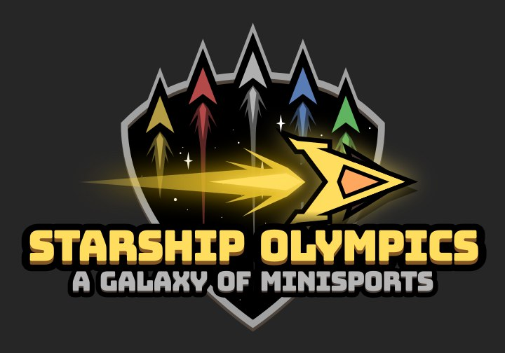

# SuperStarfighter (Starship Olympics)

<!--  -->

- 1 to 4 players fast-paced arcade combat party game
- Intuitive and expressive single-button controls: everyone can pick up a controller and play!
- 20+ games in one (eventually! lots in development :D)
- Solo, versus, co-op modes
- Made with love, and Free and Open Source Software
- Also free and open source itself :)

## Follow the development

This game is being developed on **`Godot v3.4.3`** 

Join our discord or follow us on Twitter ([@notapixelstudio](https://twitter.com/notapixelstudio)) or on [Instagram](https://instagram.com/notapixelstudio) 

  

Download the game from [itch.io](https://notapixel.itch.io/superstarfighter), or help us shaping it by joining our Discord: https://discord.gg/tchr6qpj59.

## Resources used and acknowledgements

All the resources hereby cited are free and royalty-free. Made by the community or contributors.

### Game Assets and Third party

All the game assets (art, audio, texture, .svg files) under the folder assets, if not explicitly stated otherwise are under [CC BY NC SA](https://creativecommons.org/licenses/by-nc-sa/2.0/), made by notapixelstudio, the community or contributors. Some of them are from third-party, credited below or explicitly stated under the respective folder.  

(Since this game is in Development the following list might change often)

#### Soundtrack

- [Mattek - Paradoxal Activity](https://soundcloud.com/themattek/mattek-paradoxal-activity)
- Sounds and music from [freesound](https://freesound.org/people/salvob41/downloaded_sounds)

#### Sounds

- [Aidave from freesound](https://freesound.org/people/aidave/downloaded_sounds)
- [List of free sounds](https://v-play.net/game-resources/16-sites-featuring-free-game-sounds)
- [Uso_sketch](https://freesound.org/people/uso_sketch/sounds/443865)
- [GameAudio](https://freesound.org/people/GameAudio/packs/13940/)
- [Jalastram](https://freesound.org/people/jalastram/packs/17801)
- [LewislancasterMusic](https://soundcloud.com/lewislancastermusic) : 0555, 0013shed

#### Images

- icons got from [icons8](https://icons8.com) website
- icons from the excellent https://game-icons.net project!
- [Lorc](http://lorcblog.blogspot.com)
- [Darkzaitzev](https://www.deviantart.com/darkzaitzev)

## License

All the code used in this project is opensource and under the MIT License so you can use any part of it on your games developped in GodotEngine (that is also under the [MIT License](https://godotengine.org/license)).

This program is distributed under three different licenses:

1. Source code and official releases/binaries are distributed under
   our [End-User License Agreement for Aseprite (EULA)](EULA.txt). Please check
   that there are [modules/libraries in the source code](src/README.md) that
   are distributed under the MIT license
   (e.g. [laf](https://github.com/aseprite/laf),
   [clip](https://github.com/aseprite/clip),
   [undo](https://github.com/aseprite/undo),
   [observable](https://github.com/aseprite/observable),
   [ui](src/ui), etc.).
2. You can request a special
   [educational license](https://www.aseprite.org/faq/#is-there-an-educational-license)
   in case you are a teacher in an educational institution and want to
   use Aseprite in your classroom (in-situ).
3. Steam releases are distributed under the terms of the
   [Steam Subscriber Agreement](http://store.steampowered.com/subscriber_agreement/).

You can get more information about Aseprite license in the
[FAQ](https://www.aseprite.org/faq/#licensing-&-commercial).