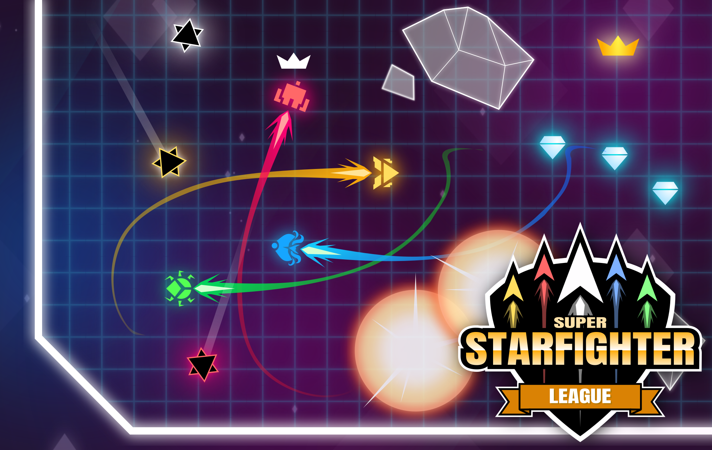

# SuperStarfighter

<!--  -->

- 1 to 4 players fast-paced arcade combat party game
- Intuitive and expressive single-button controls: everyone can pick up a controller and play!
- 20+ games in one (eventually! currently 7 :D)
- Solo, versus, co-op modes
- Made with love, and Free and Open Source Software
- Also free and open source itself :)

## Follow the development

Join our discord or follow us on Twitter ([@notapixelstudio](twitter.com/notapixelstudio)) or on [Instagram](instagram.com/notapixelstudio) 

  

Download the game from [itch.io](https://notapixel.itch.io/superstarfighter), or help us shaping it by joining our Discord: https://discord.gg/3k4NzEj.

## Resources used and acknowledgements

All the resources hereby cited are free and royalty-free. Made by the community or contributors.

## Assets

(Since this game is in Development the following list might change often)

### Soundtrack

- [Mattek - Paradoxal Activity](https://soundcloud.com/themattek/mattek-paradoxal-activity)
- Sounds and music from [freesound](https://freesound.org/people/salvob41/downloaded_sounds)

### Sounds

- [Aidave from freesound](https://freesound.org/people/aidave/downloaded_sounds)
- [List of free sounds](https://v-play.net/game-resources/16-sites-featuring-free-game-sounds)
- [Uso_sketch](https://freesound.org/people/uso_sketch/sounds/443865)
- [GameAudio](https://freesound.org/people/GameAudio/packs/13940/)
- [Jalastram](https://freesound.org/people/jalastram/packs/17801)

### Images

- icons got from [icons8](https://icons8.com) website
- icons from the excellent https://game-icons.net project!
- [Lorc](http://lorcblog.blogspot.com)
- [Darkzaitzev](https://www.deviantart.com/darkzaitzev)