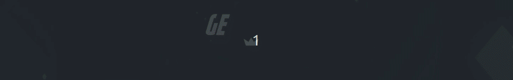
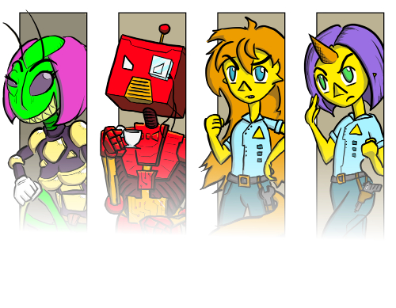
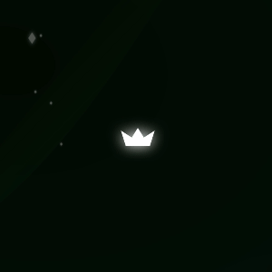
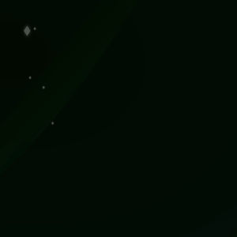
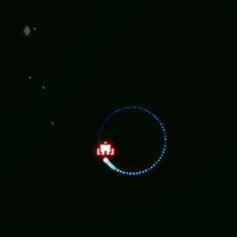
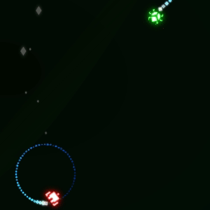
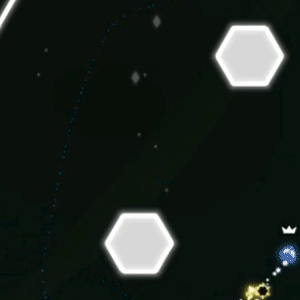
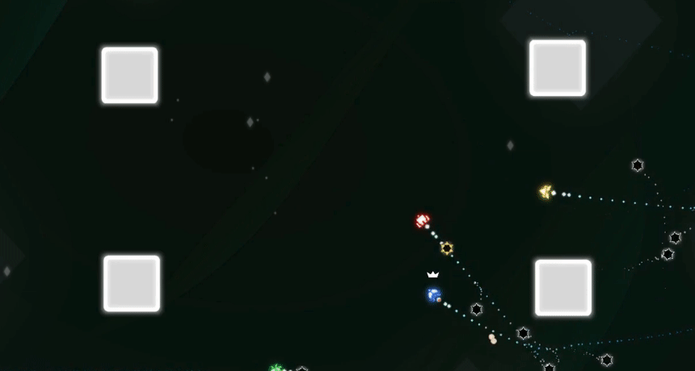
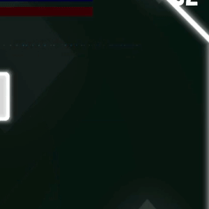

*Superstarfighter* is a fast-paced local party game for up to 4 players. Outmaneuver and shoot your opponents in a 2d top-down arena, and become an intergalactic champion!

Download here!

The game is open source and currently under active development [here on GitHub](https://github.com/notapixelstudio/superstarfighter). Help is welcome! You can try our current prototype [here on itch.io](https://notapixel.itch.io/superstarfighter).

# Local multiplayer arena
The game supports 2 to 4 players, so you have to find some friends to defeat. Each player starts by choosing an alien pilot of their liking to enter the *Superstarfighter* league.

The goal is to take the crown at the center of the arena and to keep it for as long as possible. Sounds simple, right..? Well...

Nothing makes other pilots more angry than you zipping away with the crown. That's why each *Superstarfighter* starship has a built-in relief valve for pilots: bombs.

You can find your inner peace by repeatedly pressing the *fire* button and trying to drop bombs in front of your opponent...

...or you can try a more focused, zen-like approach and keep the button pressed until you can blast them with a precise shot. Just mind the recoil!

And don't mind if your aim sucks, *Superstarfighter* bombs are equipped with a fierce locking system!

# Non-stop action
As a skilled starship pilot, you will have to steer and drop bombs while constantly moving at full speed. Brakes are for losers!

The only way to reduce your speed is to charge a shot. But this will just make you stop for a very short amount of time, before being launched at crazy speed in the direction you are facing.

# Physics-based mayhem
*Superstarfighter* arenas are chock full of moving objects, bombs, and explosions. Chasing the crown as it's slinged across a bomb-filled level is no easy feat!

# No downtime
A true starship pilot can never rest! As soon as your ship is destroyed, your team provides you with a brand new one to reenter the fray. You will never have to wait for your turn again!

# Lots of unlockable content
In the full version of the game you will be able to unlock new races, pilots and arenas.

